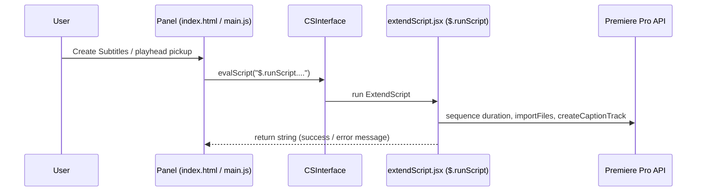

# Developer documentation — Slide and Align Subtitle Tool

Audience: maintainers extending or debugging this Premiere CEP extension.

## Architecture

The panel is **CEP** (HTML/Chromium + `main.js`). Host logic lives in **`jsx/extendScript.jsx`**, exposed as a global object **`$.runScript`** (methods are invoked from the panel via **`CSInterface.evalScript`**).

Unlike the Click-and-Align tool, this extension does **not** use `$.evalFile` from the panel: Premiere loads `extendScript.jsx` through **`ScriptPath`** in `CSXS/manifest.xml`.

| Layer | Role |
|--------|------|
| `index.html` | File input, timing mode, optional manual times, word spacing, result area |
| `main.js` | Builds escaped `evalScript` string, validates UI, playhead time pickup |
| `jsx/extendScript.jsx` | `$.runScript`: duration, proportional SRT build, temp file, import, caption track |
| `CSXS/manifest.xml` | Registers `MainPath` + **`ScriptPath` → `extendScript.jsx`** |

## UI → ExtendScript map

| UI | `main.js` behavior | ExtendScript |
|----|------------------|--------------|
| **Create Subtitles** (`runButton`) | Requires timing mode + chosen `.txt` path; escapes path and optional times; calls eval | `$.runScript.runSubtitleWorkflow(timingMode, scriptPath, wordSpacing, startTimeStr, endTimeStr)` |
| **Set from playhead** (start/end) | `csInterface.evalScript('$.runScript.getPlayheadTimeFormatted()', …)` | `getPlayheadTimeFormatted` |
| Timing mode buttons | Shows/hides manual time fields only (no host call) | — |
| Word spacing controls | Updates **panel** slider/input only until Run; value passed as **number** into `runSubtitleWorkflow` | Clamped again in `runSubtitleWorkflow` / `createSubtitlesFromFile` |

**Path handling:** The panel reads `files[0].path` (or `name` fallback), normalizes slashes, strips `file://`, fixes leading `/C:/` on Windows, then escapes quotes/newlines for the eval string.

## Workflow summary

1. **`runSubtitleWorkflow`**
   - Requires active sequence and non-empty `scriptPath`.
   - **`automated`:** `totalDuration = getVideoDuration()`, `startTime = 0`.
   - **`manual`:** Parses `startTimeStr` / `endTimeStr` with `parseTimeToSeconds` (HH:MM:SS, optional fractional); `totalDuration = end - start`, `startTime = start`.
2. **`createSubtitlesFromFile(filePath, wordSpacing, totalDuration, startTimeOffset)`**
   - Reads `.txt` via `readTextFileTolerant`, non-empty lines only, per-line word counts.
   - Each line’s duration = `(lineWords / totalWords) * totalDuration`; cues are contiguous from `startTimeOffset`.
   - Builds SRT, writes temp file under `Folder.temp`, **`importFiles`** + bin count check, retry **CRLF + UTF-8 BOM**, then **`createCaptionTrack(importedSRT, 0)`**.
3. Return value is a **string** shown in `#result` (success or error). Panel treats messages containing `"error"` (case-insensitive) as error styling.

## Word spacing notes

- UI allows **0–15** in HTML. **`runSubtitleWorkflow`** clamps NaN or negative to **0**, max **15**.
- **`createSubtitlesFromFile`** then enforces **minimum 1** if `!wordSpacing || wordSpacing < 1`, so **0 becomes 1** in practice for spacing application.

## Major functions — `main.js`

| Function | Purpose |
|----------|---------|
| `safeEvalScript(script, callback)` | Wraps `evalScript`; on failure or missing CEP, `callback(null)`. |
| `updateTimingMode()` | Toggles visibility of manual start/end groups based on `.timing-btn.active` (`data-timing`). |
| `runButton` handler | Validates file + mode; builds `$.runScript.runSubtitleWorkflow(...)` string; shows result in `#result`. |
| `formatTimeInput` / `validateTimeInput` | Manual `HH:MM:SS` shaping and regex validation (border highlight on error). |
| `setTimeFromPlayhead` | Calls `getPlayheadTimeFormatted`; on `ERROR:` prefix shows error; on `H:MM:SS` pattern sets input. |

## Major functions — `extendScript.jsx` (`$.runScript`)

Top-level helpers (not on `$.runScript`): **`readFileAsBinary`**, **`decodeUTF8`** (decoder present; **not currently used** by `readTextFileTolerant`, which uses UTF-8/UTF-16 text reads), **`readTextFileTolerant`**.

| Method | Purpose |
|--------|---------|
| `getVideoDuration()` | Active sequence duration via `end` / `duration` / video track clip ends / `getPlayerBounds`; fallback **60** seconds. |
| `applyWordSpacing(line, spacing)` | Integer spaces + thin spaces (U+2009) for fractional part; replaces space runs. |
| `toSRTTime(timeInSeconds)` | Seconds → `HH:MM:SS,mmm`. |
| `parseTimeToSeconds(timeStr)` | `HH:MM:SS` with optional `,` or `.` ms → seconds. |
| `toHHMMSS(timeInSeconds)` | Floor seconds → `HH:MM:SS` (playhead display). |
| `getPlayheadTimeFormatted()` | Returns `HH:MM:SS` or `ERROR: …` string. |
| `createSubtitlesFromFile(...)` | Full read → proportional SRT → temp file → import → caption track; returns status string. |
| `runSubtitleWorkflow(...)` | Resolves automated vs manual window, then delegates to `createSubtitlesFromFile`. |

---

## Detailed reference — important functions

### `runSubtitleWorkflow(timingMode, scriptPath, wordSpacing, startTimeStr, endTimeStr)`

- **Preconditions:** `app.project.activeSequence` must exist.
- **`timingMode === 'manual'`:** Both times must parse; end must be after start. Otherwise returns a short error string (no throw).
- **`timingMode !== 'manual'`:** Treated as automated; uses `getVideoDuration()`; if duration missing or ≤ 0, returns error string.
- **`wordSpacing`:** Normalized to 0–15 in this function; further minimum enforced in `createSubtitlesFromFile`.
- **Return:** Whatever **`createSubtitlesFromFile`** returns (success or error message).

### `createSubtitlesFromFile(filePath, wordSpacing, totalDuration, startTimeOffset)`

- **Path:** Normalizes slashes and strips `file://` (again) before `new File(...)`.
- **Read:** `readTextFileTolerant`; empty read → user-facing error string.
- **Lines:** Trimmed non-empty lines only; word count = split on whitespace, non-empty tokens.
- **Timing:** `durations[i] = (wordCounts[i] / totalWords) * totalDuration`; SRT cues are back-to-back from `startTimeOffset`.
- **Temp file:** `Folder.temp` + `temp_subtitles_<timestamp>.srt`; `getSep()` for OS folder separator.
- **Import:** Same pattern as Click-and-Align: compare bin `numItems` before/after; retry with CRLF + BOM if needed.
- **Caption track:** `activeSeq.createCaptionTrack(importedSRT, 0)`.
- **Feedback:** `app.setSDKEventMessage` for many steps; return string duplicated for panel `#result`.

### `getVideoDuration()`

- Tries, in order: `activeSeq.end.seconds`, `activeSeq.duration.seconds`, max of video track clip ends, `getPlayerBounds().width.seconds`.
- Returns **`60`** if nothing positive is found (automated mode may then distribute subtitles across a default minute — be aware for short/empty timelines).

### `getPlayheadTimeFormatted()`

- Uses `activeSequence.getPlayerPosition().seconds` and `toHHMMSS`.
- Any failure → string beginning with **`ERROR:`** (panel treats as error when setting time from playhead).

---

## Extension manifest (source of truth)

| Item | Value |
|------|--------|
| Bundle ID | `org.planetread.slidealignsubtitletool` |
| Bundle version | `1.0.0` |
| Panel extension ID | `org.planetread.slidealignsubtitletool.panel` |
| Premiere host | `PPRO`, **`[25.0, 25.9]`** |
| CEP runtime | CSXS **12.0** |
| `MainPath` | `./index.html` |
| `ScriptPath` | `./jsx/extendScript.jsx` |
| Default panel size | 400 × 800 |
| CEF flags | `--enable-nodejs`, `--mixed-context` |

---

## Debugging

### Panel (`main.js`)

- Enable **PlayerDebugMode** for the matching CSXS version; add a **`.debug`** file in the extension root listing extension id **`org.planetread.slidealignsubtitletool.panel`** and host **`PPRO`** (see [Adobe-CEP/CEP-Resources](https://github.com/Adobe-CEP/CEP-Resources)).
- Attach Chromium DevTools to the logged port; use **`console.log`** in `main.js`.

### ExtendScript (`extendScript.jsx`)

- **`app.setSDKEventMessage(message, 'info')`** from `createSubtitlesFromFile` (Events / info line in Premiere, depending on build).
- ExtendScript **`$.writeln`** if you attach a host console workflow.

---

## Known issues and follow-ups

| Topic | Detail |
|--------|--------|
| Unused `decodeUTF8` | Implemented at top of `extendScript.jsx` but **not** referenced; `readTextFileTolerant` uses encoded reads instead. Safe to remove or wire for binary UTF-8 reads if you change I/O. |
| `getVideoDuration` fallback | **60 s** default can mis-scale automated timing on empty or very short sequences. Consider surfacing a warning or requiring manual mode. |
| `lib/CSInterface.js` | Extra copy under `lib/`; **`index.html` loads root `CSInterface.js`**. Remove duplicate or document why two copies exist. |
| README install path | README mentions copying a **`V1`** folder; align folder name with **`SlideAndAlignSubtitleTool`** for clarity. |

---

## Data locations and privacy

| Data | Location |
|------|-----------|
| Temp SRT | `Folder.temp` — `temp_subtitles_<timestamp>.srt` |

Panel and `extendScript.jsx` subtitle logic do **not** send subtitle text over the network. `CSInterface.js` may contain generic HTTP helpers; this feature path does not add remote calls.

---

## Manual testing checklist

- [ ] Extension loads: **Window → Extensions → Slide and Align Subtitle Tool**.
- [ ] **Automated:** `.txt` with several lines; sequence with known duration; captions cover timeline proportionally; word-heavy lines longer.
- [ ] **Manual:** Valid `HH:MM:SS` start/end; end > start; same proportional behavior inside window.
- [ ] **Invalid manual times:** Error string in `#result`; no crash.
- [ ] **Playhead pickup:** Sets start/end fields when sequence active; error when no sequence.
- [ ] **Word spacing:** Extreme values (0, 15) and mid-range; confirm caption appearance.
- [ ] **Import retry:** If your build fails first import, confirm CRLF+BOM retry path (bin count increases).
- [ ] **Windows + macOS paths:** File chosen from OS dialog opens in ExtendScript (`path` normalization).

---

## Related files

- `CSInterface.js` — CEP bridge (loaded by `index.html`).
- `lib/CSInterface.js` — Duplicate copy (see known issues).
- `CSXS/manifest.xml` — Bundle IDs, host range, `ScriptPath` / `MainPath`.
